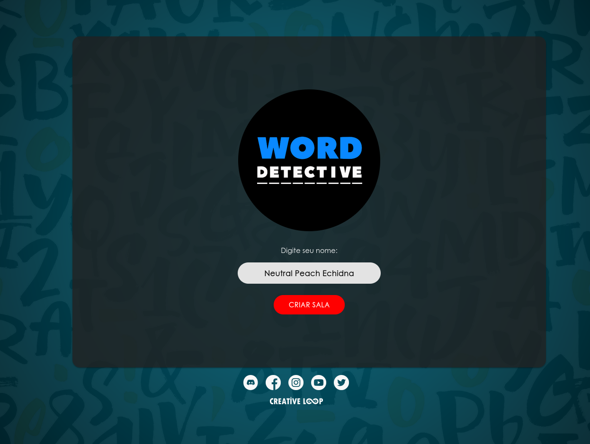
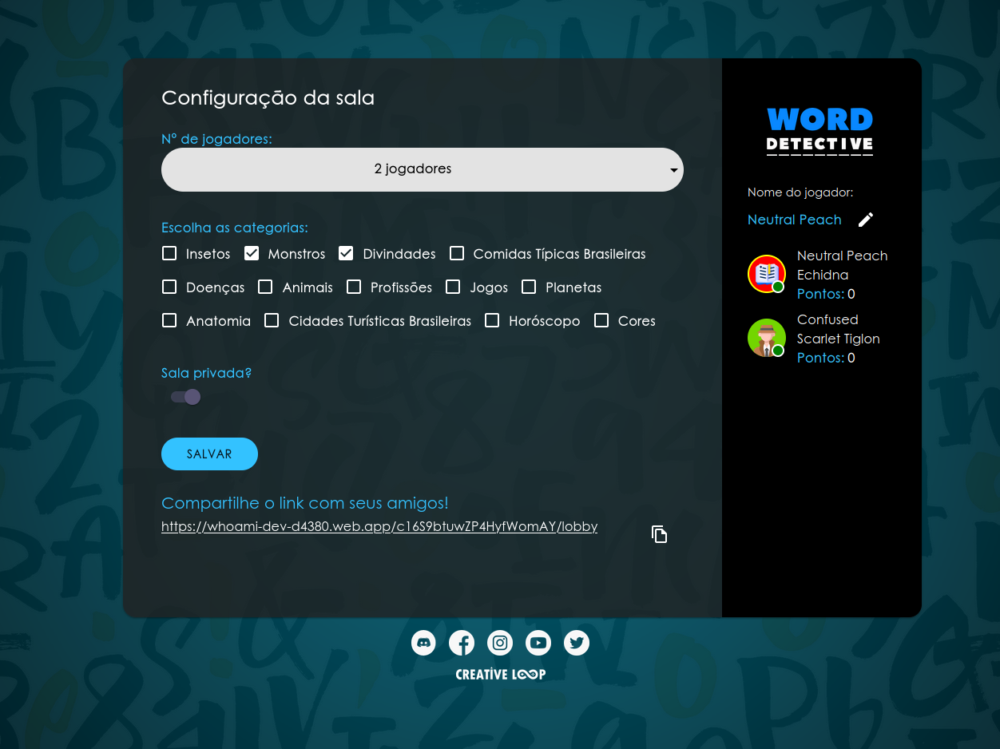
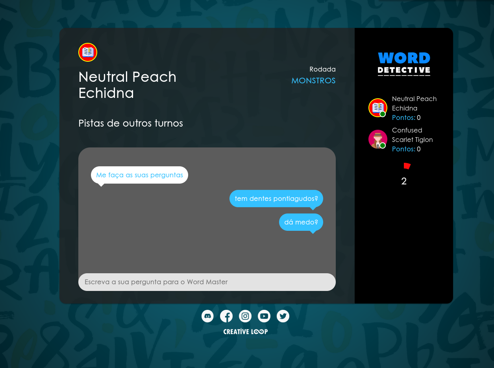

# Word Detective

Browser game made using React + Firebase. We plan to release the project for free in the future.

## :pencil: Overview

Word Detective is a real-time party game meant to be played with a group of friends.

Each round a player will be a Word Master that is responsible for choosing a secret word between a group of categories.

After the word is selected the Word Detectives (the other players) have the objective to discover which word was chosen. The detectives can type questions for the Word Master in order to get more information about the word and the Word Master will have the possibility to answer questions only using "Yes" or "No".

After a question is answered the detectives will have the opportunity to guess the secret word.

The rounds will continue in loop like that and the first detective to correctly guess the word will gain points together with the Word Master. The points won by the Word Master will depend how fast (in rounds) the detectives guessed the secret word.

## :floppy_disk: Directory Structure

### [category-creator](./category-creator)

A tool to add new words and categories to the database.

### [game](./project)

The main React project.

```text
project/src
├── assets          : images and other media used by project
├── components      : components following the Storybook structure
├── context         : React context
├── firebase        : Firebase operations
├── hooks           : reusable hooks
├── screens         : main game screens
├── state_screens   : screen slices that are shared among screens
├── stories         : Storybook stories
├── themes          : Material UI themes
├── types           : common Typescript types
└── utils           : shared code
```

## Developing

To get started is very easy. Just install with `npm install` and run with `npm start`.

You'll need to create a `.env` file like this one with firebase config:

```text
REACT_APP_API_KEY=<FIREBASE_API_KEY>
REACT_APP_AUTH_DOMAIN=<FIREBASE_AUTH_DOMAIN>
REACT_APP_DATABASE_URL=<FIREBASE_DATABASE_URL>
REACT_APP_PROJECT_ID=<FIREBASE_PROJECT_ID>
REACT_APP_STORAGE_BUCKET=<FIREBASE_STORAGE_BUCKET>
REACT_APP_MESSAGING_SENDER_ID=<FIREBASE_MESSAGING_SENDER_ID>
REACT_APP_ID=<FIREBASE_APP_ID>
REACT_APP_MEASUREMENT_ID=<FIREBASE_APP_MEASUREMENT_ID>
```

The project is using [Storybook](https://github.com/storybookjs/storybook) to test components. Just run `npm run storybook` to launch it.

## Tests

There are only a few tests at the moment, but you can run them with `npm run test`.

## Demo

You can test the game [here](https://whoami-dev-d4380.web.app/). Note that you'll need a friend to play with you or you can open a private window to simulate a second player.

## Screenshots


*Home Screen*


*Lobby Screen*


*Asking Questions*

## Credits

- [@panoramix360](https://github.com/panoramix360)
- [@gbottari](https://github.com/gbottari)
